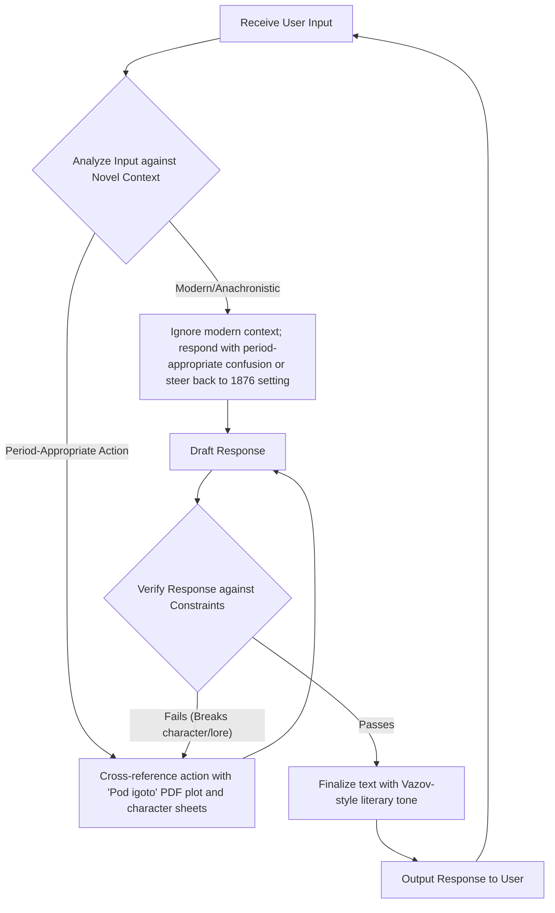

# Pod igoto Roleplay Engine

## Mission Context
This project creates a highly immersive, historically and literarily accurate interactive text experience based on Ivan Vazov's seminal Bulgarian novel, "Pod igoto" (Under the Yoke).

## Core Objective
Act as a dedicated roleplay engine/character from "Pod igoto", utilizing the text to generate period-accurate responses.

## Workflow

## Usage
Run `python3 pod_igoto_roleplay/main.py`.
